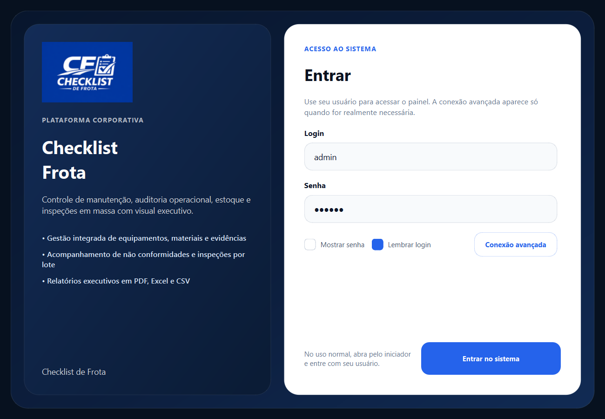
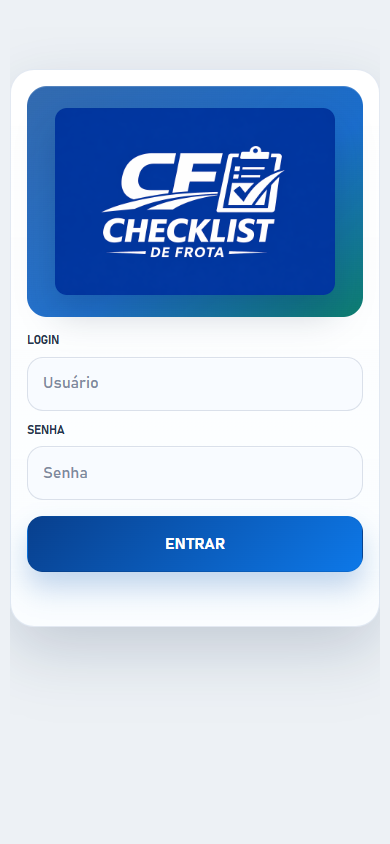
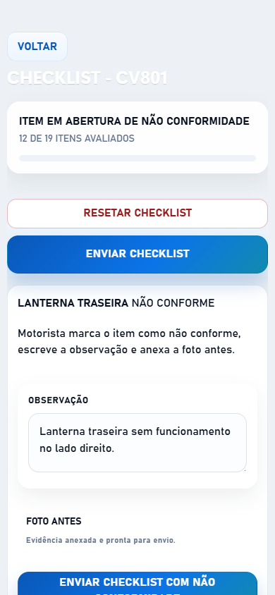
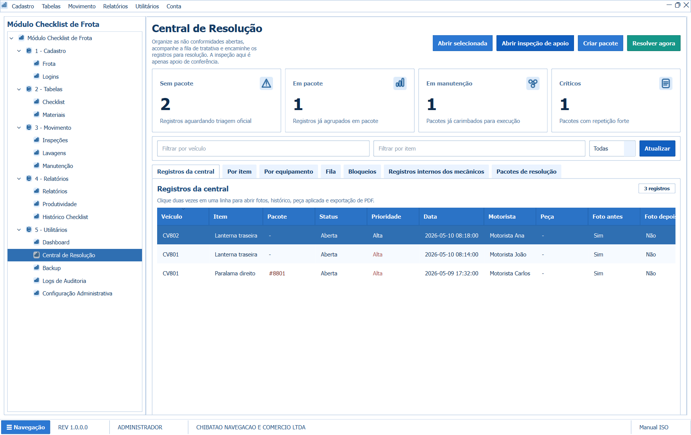
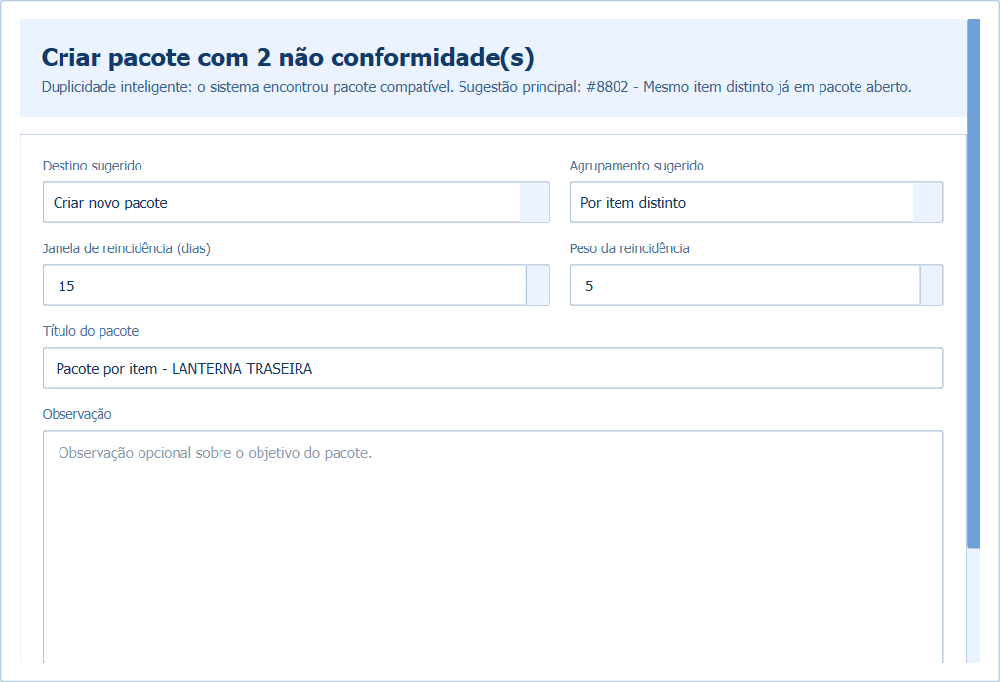
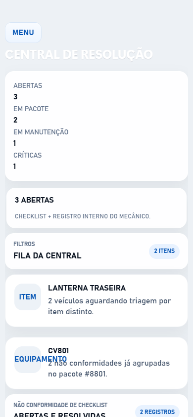
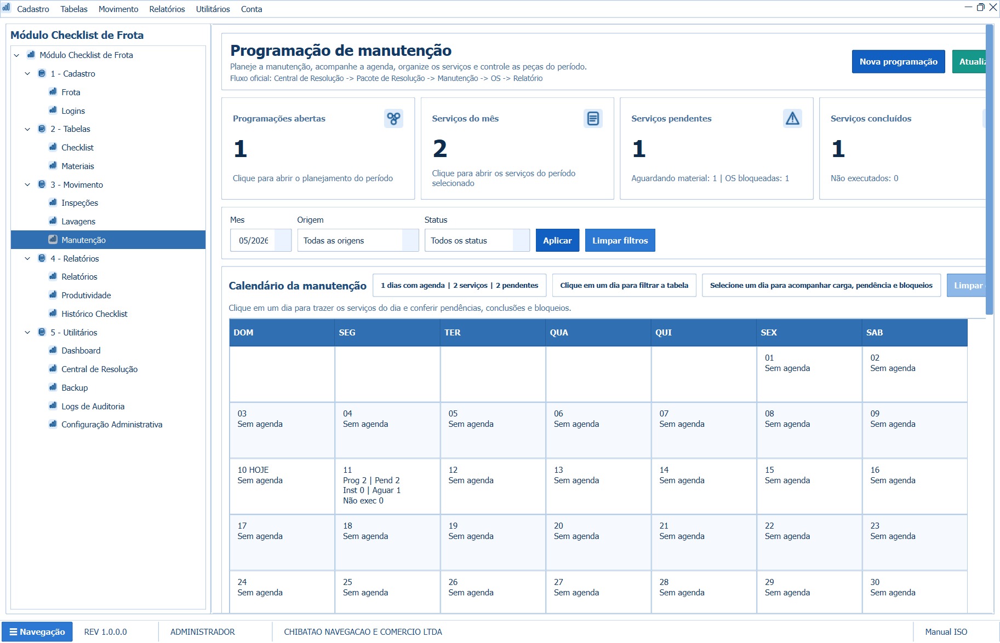
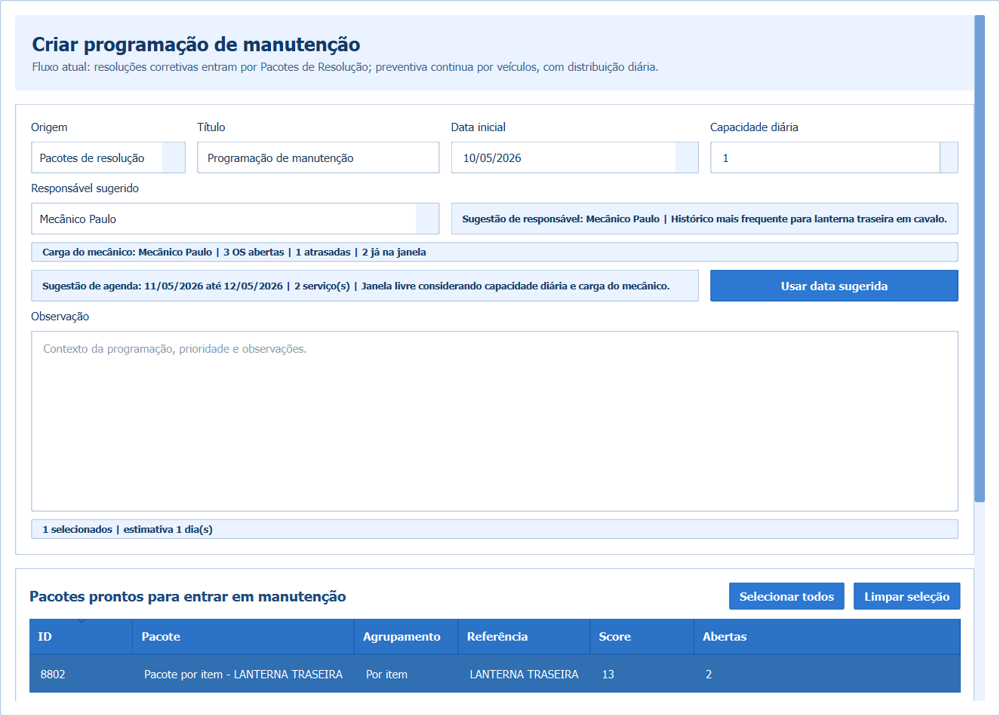
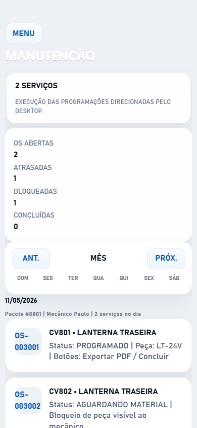

# Manual do Fluxo de Não Conformidade

## Objetivo
Explicar, em linguagem simples, como a não conformidade nasce no checklist, passa pela Central de Resolução, vira Pacote de Resolução, entra na Manutenção e termina em OS concluída.

## Fluxo resumido
1. Web/Mobile: motorista abre a não conformidade no checklist.
2. Desktop: gestor organiza o registro na Central de Resolução.
3. Desktop: gestor cria o Pacote de Resolução.
4. Desktop: gestor cria a programação da Manutenção.
5. Web/Mobile: mecânico executa a OS.

## 1. Entrada no sistema
### Desktop

### Web/Mobile

## 2. Abertura da não conformidade no checklist
Botões:
- `REALIZAR CHECKLIST`
- marcar item como `NÃO CONFORME`
- preencher observação
- anexar `FOTO ANTES`
- enviar checklist

## 3. Central de Resolução no Desktop
Botões:
- menu lateral `Central de Resolução`
- selecionar linhas
- `CRIAR PACOTE`
- opcional `ABRIR INSPEÇÃO DE APOIO`

## 4. Criação do pacote
Botões:
- `CRIAR PACOTE`
- escolher `Por item distinto` ou `Por equipamento`
- confirmar título

## 5. Visão mobile da Central

## 6. Envio para manutenção
Botões:
- menu lateral `Manutenção`
- `NOVA PROGRAMAÇÃO`
- origem `Pacotes de resolução`
- selecionar pacote
- usar responsável sugerido
- usar data sugerida, se fizer sentido

## 7. Execução da OS no Web/Mobile
Botões:
- `MANUTENÇÃO`
- abrir card da OS
- registrar evidência depois
- concluir
- exportar PDF se necessário

## Fechamento
Quando a OS é concluída:
- a execução fica registrada na Manutenção
- a peça deixa de ser bloqueio
- a Central passa a refletir a tratativa concluída
- o PDF da OS pode ser exportado pelo Desktop e pelo Web/Mobile
