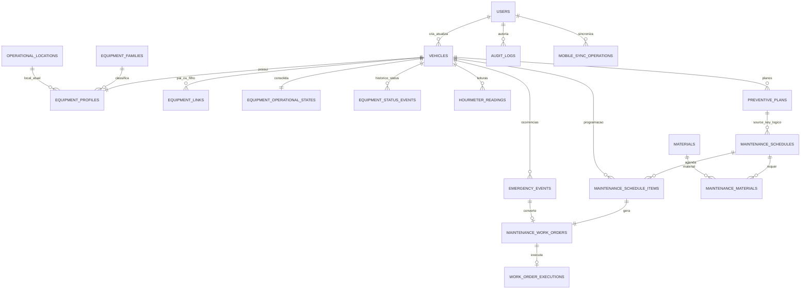

# Mapa do banco

## Fonte do mapa

Mapa logico derivado de 46 `__tablename__` em `backend/app/models/` e da cadeia `20260712_0000` a `20260713_0009` em `migrations/versions/`. O PostgreSQL fisico de producao nao foi inspecionado; divergencias reais continuam pendentes de comparacao.

## Diagrama logico PCM

Observacao: `PreventivePlan` se relaciona com `MaintenanceSchedule` pelo `source_key` textual `PREVENTIVA_PCM:{plan_id}:{sequencia}`, nao por FK. Esse e um ponto de fragilidade para normalizacao futura.

## Tabelas centrais

| Tabela / model | PK | FKs principais | Obrigatorios/restricoes | Indices/unique | Uso real |
|---|---|---|---|---|---|
| `users` / `User` | `id` | - | nome, login, senha_hash, tipo, ativo | login unique/index; tipo/ativo index | autenticacao e autoria |
| `vehicles` / `Vehicle` | `id` | - | placa, modelo, frota, tipo, ativo | frota unique; placa/frota/tipo index | raiz do equipamento |
| `equipment_families` | `id` | - | code, name, flags | code/name unique | RTG/LBS/Spreader |
| `operational_locations` | `id` | `parent_id -> self` | code, name, type | code unique | area/patio/berco hierarquico |
| `equipment_profiles` | `id` | `vehicle_id`, `family_id`, `operational_location_id` | vehicle/family/criticality | vehicle unique; serial unique | complemento tecnico/local atual |
| `equipment_links` | `id` | parent/child vehicle, created_by user | tipo, inicio, ativo | FKs/index; checks pai diferente | vinculo temporal LBS-Spreader |
| `equipment_operational_states` | `id` | `vehicle_id` | status e checks de leitura | vehicle unique | snapshot de status/horimetro |
| `equipment_status_events` | `id` | vehicle, created_by | status, source, inicio | status/datas/FKs index | historico de disponibilidade |
| `hourmeter_readings` | `id` | vehicle, created_by | leitura >= 0; data nao futura na regra | unique `(vehicle_id, recorded_at)` | serie de horimetro |
| `preventive_plans` | `id` | vehicle, mecanico, created_by | gatilho/prioridade/status; intervalos positivos | code unique; vencimentos index | plano preventivo |
| `maintenance_schedules` | `id` | created_by, mecanico | source_type/status/capacidade | unique `(source_type, source_key)` | programacao/agenda |
| `maintenance_schedule_items` | `id` | schedule, vehicle, checklist, activity, users | status e schedule/vehicle | checklist_item unique | execucao por ativo |
| `maintenance_work_orders` | `id` | schedule, item, vehicle, users, package | numero, titulo, status | order_number unique; item unique | unica OS do sistema |
| `work_order_executions` | `id` | work_order, released_by | inicio da falha; checks temporais | work_order unique | reparo, teste e liberacao |
| `emergency_events` | `id` | vehicle, users, work_order | numero, severidade, titulo, descricao | event_number unique; work_order unique | corretiva emergencial |
| `maintenance_materials` | `id` | schedule, material | quantidades nao negativas/status | FKs index | necessidade de material |
| `mobile_sync_operations` | `id` | vehicle, user | operation_id/hash/tipo/status | operation_id unique | idempotencia offline |
| `audit_logs` | `id` | user | entidade, id, acao | evidencia no model sem indices declarados relevantes | trilha de alteracao |

## Tabelas de apoio em uso

| Dominio | Tabelas |
|---|---|
| Checklist | `checklists`, `checklist_items`, `checklist_catalog_items` |
| Atividades/NC | `activities`, `activity_items`, `activity_non_conformity_links`, `mechanic_non_conformities` |
| Resolucao | `resolution_packages`, `resolution_package_links` |
| Materiais | `materials`, `material_movements` |
| Suprimentos | `warehouses`, `warehouse_stocks`, `material_family_applications`, `warehouse_reservations` |
| Biblioteca | `technical_documents` |
| Inspecoes | `inspection_templates`, `inspection_template_items`, `inspection_executions`, `inspection_execution_items` |
| Inteligencia | `automation_executions` |
| Seguranca/configuracao | `revoked_tokens`, `system_settings` |
| Lavagem | `wash_queue_items`, `wash_records`, `wash_plan_configs`, `wash_blocked_days`, `wash_schedule_decisions` |

Nao foi comprovada tabela sem uso pelo codigo. Confirmar tabelas vazias, orfas ou legadas exige consulta ao banco fisico e contagem de registros.

## Redundancias e risco de divergencia

| Dado | Locais atuais | Risco | Recomendacao |
|---|---|---|---|
| Tipo/familia | `Vehicle.tipo` e `EquipmentProfile.family_id` | valores divergentes | familia como fonte oficial, tipo legado compativel |
| Local | `Vehicle.local` e `EquipmentProfile.operational_location_id` | texto x FK | location_id oficial; texto somente compatibilidade |
| Status | `Vehicle.status` e `EquipmentOperationalState.operational_status` | administrativo x operacional confundidos | nomear conceitos separadamente |
| Horimetro atual | estado consolidado e ultima linha de `hourmeter_readings` | snapshot desatualizado | atualizar transacionalmente e reconciliar |
| Mecanico | schedule, item e work_order | atribuicoes diferentes | definir precedencia e historico |
| Plano x agenda | `source_key` textual | FK nao garantida | adicionar FK opcional futura sem quebrar legado |

## Tabelas/estruturas ausentes

1. Movimento de localizacao com origem, destino, data/hora, motivo e responsavel.
2. Evento/historico de status da OS para cancelamento, reabertura e justificativas.
3. Evidencia/anexo normalizado com nome, MIME, tamanho, hash, usuario e vinculos.
4. Configuracao e execucao de ciclo preventivo 500-6000 h.
5. Correcao/aprovacao de leitura de horimetro.
6. Lote de importacao, staging, erros e reconciliacao.
7. Sequencia/controle de numeracao oficial de OS, se o formato deixar de usar apenas PK.
8. View/materialized view ou consulta Base Mestre para BI.

## Campos ausentes na OS atual

O model `MaintenanceWorkOrder` possui numero, agenda/item, pacote, equipamento, mecanico, abertura, titulo, item, status, data programada e timestamps. Parte dos dados existe em `WorkOrderExecution` e `MaintenanceSchedule`. Ainda nao ha persistencia clara para especialidade, classificacao oficial, equipe, fornecedor, horimetros de abertura/inicio/fim, horas planejadas, impacto, sintoma, causa estruturada, atualizado por e prazo.

## Riscos de migration

- Produzir migration antes de comparar o PostgreSQL pode duplicar coluna criada por `runtime_schema_service.py`.
- Novos `NOT NULL` podem falhar em dados legados; usar nullable/backfill/constraint em etapas.
- Renomear `vehicles` ou `Vehicle.tipo` quebraria Desktop, Mobile, relatatorios e imports; nao recomendado.
- Alterar valores de status diretamente pode violar checks e filtros existentes.
- Nova numeracao de OS deve preservar numeros atuais e unique index.
- Relacionar plano-agenda por FK exige backfill confiavel do `source_key`.
- Rollback de anexos deve ser coordenado entre banco e Supabase Storage.

## Comparacao obrigatoria antes da implementacao

1. Registrar `alembic current` e `alembic heads` no ambiente de producao.
2. Exportar schema-only do PostgreSQL.
3. Comparar tabelas, colunas, tipos, defaults, FKs, indices e checks com models/migrations.
4. Identificar objetos criados somente por runtime.
5. Contar nulos/duplicados antes de constraints.
6. Gerar relatorio de impacto e backup testado.
